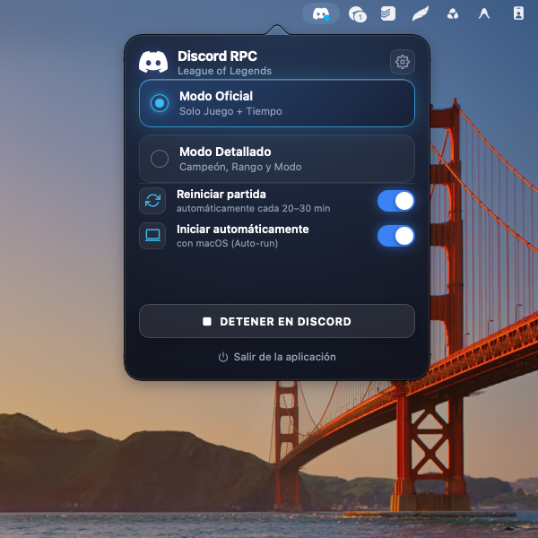

# Discord RPC para macOS

[](https://www.apple.com/macos/)
[](https://www.python.org/)
[](https://pyobjc.readthedocs.io/)
[](https://discord.com/)
[-success)](#suite-de-pruebas-automatizadas)
[]()

<p align="center">
  
</p>

Aplicación nativa para la barra de menús de macOS (`LSUIElement` / Menubar Accessory) que sincroniza en tiempo real tu presencia enriquecida (Rich Presence) de League of Legends y otros títulos en Discord. Diseñada con una interfaz flotante nativa (`NSPopover`), tema oscuro traslúcido, buscador de 173 campeones con avatares en tiempo real, botones de perfil interactivos y arquitectura de hilos concurrente con reconexión automática.

---

## Tabla de Contenidos

- [Características Principales](#características-principales)
- [Requisitos del Sistema](#requisitos-del-sistema)
- [Instalación Paso a Paso](#instalación-paso-a-paso)
- [Guía de Uso](#guía-de-uso)
  - [Ubicación en la barra de menús](#ubicación-en-la-barra-de-menús)
  - [Estados del icono](#estados-del-icono)
  - [Selector de modo: Oficial vs Detallado](#selector-de-modo-oficial-vs-detallado)
  - [Buscador de campeones](#buscador-de-campeones)
  - [Modos de juego y texto personalizado](#modos-de-juego-y-texto-personalizado)
  - [Rangos competitivos](#rangos-competitivos)
  - [Botones interactivos de perfil](#botones-interactivos-de-perfil)
  - [Temporizador y arranque con el sistema](#temporizador-y-arranque-con-el-sistema)
  - [Pausar, reanudar y control de presencia](#pausar-reanudar-y-control-de-presencia)
  - [Ajustes de Client ID y presets de juegos](#ajustes-de-client-id-y-presets-de-juegos)
  - [Control del ciclo de vida y salida](#control-del-ciclo-de-vida-y-salida)
- [Instalador DMG y Distribución Portátil](#instalador-dmg-y-distribución-portátil)
- [Arranque Automático con macOS](#arranque-automático-con-macos)
- [Arquitectura del Proyecto](#arquitectura-del-proyecto)
- [Suite de Pruebas Automatizadas](#suite-de-pruebas-automatizadas)
- [Preguntas Frecuentes](#preguntas-frecuentes)
- [Licencia](#licencia)

---

## Características Principales

- **Interfaz flotante Cocoa (NSPopover)**: Ventana anclada directamente al icono de estado, con soporte de desenfoque de fondo y diseño oscuro adaptativo.
- **Icono de estado reactivo**: Indicador gráfico en la barra de menú con tres estados claramente diferenciados (Normal, Activo con punto indicador y Pausado).
- **Catálogo de 173 campeones**: Búsqueda instantánea con avatares oficiales en alta resolución desde el CDN de Riot Games Data Dragon, con navegación por teclado y ratón.
- **Rangos y modos canónicos**: Modos de juego oficiales (Solo/Dúo, Flexible, ARAM, Arena, Normal, Clash) y rangos competitivos con supresión automática de divisiones en rangos Apex (Master, Grandmaster, Challenger).
- **Botones de perfil en Discord**: Configuración de hasta dos botones interactivos con enlace directo (ej. OP.GG, Twitch o servidores comunitarios).
- **Control de instancia única**: Mecanismo basado en sockets de dominio Unix que impide procesos duplicados y enfoca la ventana existente si el usuario ejecuta la aplicación nuevamente.
- **Gestión de eventos del sistema**: Reconexión automática tras la apertura de Discord o al reanudar el sistema tras suspensión.
- **Concurrencia protegida**: Modelo de hilos con bloqueos de exclusión mutua (`threading.Lock`) para evitar condiciones de carrera o bloqueos en el bucle principal de interfaz de macOS.

---

## Requisitos del Sistema

- **Sistema Operativo**: macOS 12.0 (Monterey), 13.0 (Ventura), 14.0 (Sonoma), 15.0 (Sequoia) o superior.
- **Arquitectura**: Compatible con Apple Silicon (M1/M2/M3/M4) y procesadores Intel x86_64.
- **Python**: Python 3.9 o superior.
- **Discord**: Cliente oficial de escritorio de Discord instalado y en ejecución en el equipo.

---

## Instalación Paso a Paso

### 1. Clonar el repositorio

```bash
git clone https://github.com/vcamachoone/Discord-RPC.git
cd Discord-RPC
```

### 2. Configurar el entorno virtual

```bash
python3 -m venv venv
source venv/bin/activate
```

### 3. Instalar dependencias

```bash
pip install -r requirements.txt
```

### 4. Sincronizar y generar el bundle de macOS

```bash
python sync_bundle.py
```

El script configurará e instalará la aplicación en `/Applications/League of Legends RPC.app` con su estructura de bundle, ejecutables y metadatos (`Info.plist`).

---

## Guía de Uso

### Ubicación en la barra de menús

La aplicación se ejecuta como un agente de barra de menús (`LSUIElement`), por lo que no ocupa espacio en el Dock ni en el selector de aplicaciones (`Cmd+Tab`). Su presencia se visualiza exclusivamente en la barra superior del sistema.

Para abrirla:
- Desde **Spotlight**: presiona `Cmd + Espacio`, escribe `League of Legends RPC` y pulsa `Enter`.
- O desde la terminal:
  ```bash
  open -a "/Applications/League of Legends RPC.app"
  ```

---

### Estados del icono

El icono en la barra de menú refleja el estado de la conexión en tiempo real:

| Icono | Estado | Descripción |
| :---: | :---: | :--- |
|  | **En espera / Normal** | Discord está abierto pero la sincronización de presencia está en pausa o conectando. |
|  | **Activo** | Conectado activamente. Discord muestra la presencia enriquecida en tu perfil. |
|  | **Pausado** | Presencia detenida manualmente por el usuario o cliente de Discord no detectado. |

---

### Selector de modo: Oficial vs Detallado

Al hacer clic izquierdo en el icono se despliega el popover:

1. **Modo Oficial**:
   - Presencia minimalista.
   - Muestra el nombre oficial del juego, logotipo y temporizador transcurrido.
2. **Modo Detallado**:
   - Despliega la personalización de campeón, rango competitivo y modo de juego.
   - Accesible también mediante el botón de ajustes en la esquina superior derecha del popover.

---

### Buscador de campeones

En el Modo Detallado:
- **Filtrado dinámico**: Escribe el nombre de cualquier campeón (ej. `Ahri`, `Yasuo`, `Jinx`, `Aatrox`, `Kai'Sa`).
- **Navegación por teclado**:
  - `Flecha Abajo` y `Flecha Arriba`: Desplazamiento por los resultados.
  - `Enter`: Selecciona el elemento resaltado y actualiza la presencia de inmediato.
  - `Escape`: Cierra el menú desplegable de sugerencias.
- **Normalización**: Soporta nombres compuestos y alias del API de Riot (ej. `wukong` -> `MonkeyKing`, `chogath` -> `Chogath`).

---

### Modos de juego y texto personalizado

- **Modos oficiales**:
  - Clasificatoria Solo/Dúo
  - Clasificatoria Flexible
  - Partida Normal (Reclutamiento)
  - Partida Rápida (Swiftplay)
  - ARAM
  - Arena (2v2v2v2)
  - Torneo Clash
  - Cooperativo vs IA
  - Herramienta de Práctica
- **Modo personalizado**: Selecciona la opción `Personalizado` para ingresar texto libre (ej. `Torneo Interno`, `Entrenamiento 1v1`).

---

### Rangos competitivos

- **Niveles disponibles**: Hierro, Bronce, Plata, Oro, Platino, Esmeralda, Diamante, Maestro, Gran Maestro, Challenger y Sin Rango (Unranked).
- **Divisiones**: I, II, III y IV.
- **Regla Apex**: En Maestro, Gran Maestro y Challenger, la selección de división se oculta de forma automática conforme al estándar competitivo oficial.

---

### Botones interactivos de perfil

Desde el panel de configuración (icono de engranaje) puedes definir hasta dos botones interactivos para tu perfil de Discord:
- **Botón 1**: Etiqueta (ej. `Ver OP.GG`) y URL de destino (`https://...`).
- **Botón 2**: Etiqueta (ej. `Canal de Twitch`) y URL de destino (`https://...`).
- Las URLs son validadas y sanitizadas automáticamente (forzando protocolo HTTPS y límites de longitud).

---

### Temporizador y arranque con el sistema

- **Reiniciar partida (automáticamente cada 20–30 min)**: Restablece de forma periódica el tiempo transcurrido para mantener intervalos de duración realistas.
- **Iniciar automáticamente con macOS**: Configura un agente de usuario (`LaunchAgent`) para que el servicio inicie silenciosamente al iniciar sesión en el Mac.

---

### Pausar, reanudar y control de presencia

- **Detener en Discord**: Retira la actividad de tu perfil sin cerrar la aplicación.
- **Iniciar Presencia**: Reanuda la comunicación con el socket local y publica los datos actualizados.

---

### Ajustes de Client ID y presets de juegos

El panel de configuración permite alternar entre diversos títulos predefinidos o configurar identificadores personalizados:
- League of Legends (Riot Games)
- VALORANT (Riot Games)
- Counter-Strike 2 (Valve)
- Minecraft (Mojang)
- Fortnite (Epic Games)
- Grand Theft Auto V (Rockstar Games)
- Apex Legends (Respawn / EA)
- Overwatch 2 (Blizzard)
- Dota 2 (Valve)
- Rocket League (Psyonix)
- Personalizado: Permite ingresar un Application Client ID propio generado en el Discord Developer Portal.

---

### Control del ciclo de vida y salida

Puedes finalizar la ejecución de la aplicación mediante cualquiera de los siguientes métodos:
1. **Desde el Popover**: Haz clic en el botón **Salir de la aplicación** ubicado al pie de la ventana.
2. **Desde la barra de menú**: Haz **clic derecho** sobre el icono de la barra de menú para abrir el menú contextual nativo y selecciona **Salir de la app (Cmd+Q)**.
3. **Desde la terminal**: Ejecuta `./stop.sh` dentro del directorio del proyecto.

---

## Instalador DMG y Distribución Portátil

El proyecto cuenta con un generador de paquetes DMG comprimidos (`UDZO`) para distribuir la aplicación sin requerir configuración manual de dependencias:

```bash
python build_dmg.py
```

### Características del paquete:
- **Autónomo**: Empaqueta dependencias de Python dentro del bundle en `Contents/Resources/site-packages`.
- **Lanzador universal**: Resuelve dinámicamente el intérprete de Python del sistema sin rutas absolutas de usuario.
- **Fondo de instalación**: Arte gráfico para arrastrar directamente la aplicación a `/Applications`.
- **Verificación criptográfica**: Genera un archivo `.sha256` complementario para verificar la integridad del instalador.

El archivo resultante se genera en:
```text
dist/League_of_Legends_RPC_Installer.dmg
```

---

## Arranque Automático con macOS

Al activar la opción en la interfaz, se crea el servicio de usuario en:
```text
~/Library/LaunchAgents/com.victormanuel.lolrpc.plist
```

### Comandos de gestión:
```bash
# Comprobar estado del servicio
launchctl list | grep lolrpc

# Desactivar servicio
launchctl unload ~/Library/LaunchAgents/com.victormanuel.lolrpc.plist

# Reactivar servicio
launchctl load ~/Library/LaunchAgents/com.victormanuel.lolrpc.plist
```

---

## Arquitectura del Proyecto

```text
discord-rpc/
├── /Applications/League of Legends RPC.app   # Bundle de aplicación instalado en macOS
├── app_gui.py              # Inicialización, bucle Cocoa (AppKit) y ciclo de vida
├── popover_ui.py           # Controlador NSPopover nativo y puente JavaScript/WebKit
├── liquid_html.py          # Estructura HTML5, estilos CSS3 y lógica de cliente
├── discord_rpc_manager.py  # Gestor de sockets IPC (pypresence) con reconexión
├── status_item.py          # Manejo de NSStatusItem y menú contextual
├── lol_champions.py        # Catálogo de campeones y resolución CDN
├── lol_ranks.py            # Validación de divisiones y rangos competitivos
├── sync_bundle.py          # Generador y sincronizador de bundle .app
├── build_dmg.py            # Empaquetador automatizado de instalador .dmg
├── launcher.sh             # Script de entrada de aplicación en bundle
├── requirements.txt        # Especificación de dependencias de Python
├── assets/                 # Recursos gráficos e imágenes de la interfaz
└── tests/                  # Suite completa de pruebas unitarias y de integración
```

---

## Suite de Pruebas Automatizadas

El proyecto incluye 176 pruebas automatizadas organizadas en 6 niveles de verificación:

```bash
python tests/run_tests.py
```

### Resultados de verificación:

```text
==============================================================================
FINAL TEST SUITE SUMMARY
==============================================================================
  Tier Name                                Total    Pass    Skip    Fail     Time
  -------------------------------------- ------- ------- ------- ------- --------
  Tier 1: Feature Coverage                    60      60       0       0   0.878s
  Tier 2: Boundary & Corner Cases             60      60       0       0   0.812s
  Tier 3: Cross-Feature Interactions          14      14       0       0   0.069s
  Tier 4: Real-World Scenarios                 5       5       0       0   0.164s
  Tier 5: Adversarial Stress & Faults         10      10       0       0  13.872s
  Tier 6: Production Acceptance & System      27      27       0       0   0.995s
  -------------------------------------- ------- ------- ------- ------- --------
  TOTAL                                      176     176       0       0  16.789s
==============================================================================
ALL EXECUTED TESTS PASSED CLEANLY (100% SUCCESS)
```

---

## Preguntas Frecuentes

### 1. ¿Qué sucede si la aplicación inicia antes de abrir Discord?
El administrador de presencia mantiene un ciclo de reconexión pasivo. En cuanto el proceso de Discord inicia, la conexión se establece automáticamente y el icono de la barra de menú cambia al estado activo.

### 2. ¿La aplicación almacena contraseñas o tokens de acceso de Discord?
No. La comunicación se realiza exclusivamente a través del socket IPC local del sistema operativo (`/tmp/discord-ipc-0`). No se solicitan, almacenan ni transmiten credenciales de usuario.

### 3. ¿El icono no aparece en la barra superior?
En pantallas de computadoras portátiles con muesca (notch), si existen muchos elementos en la barra de menú, macOS puede ocultar iconos auxiliares. Se recomienda cerrar iconos secundarios o utilizar herramientas de gestión de barra de estado.

### 4. ¿Cómo se actualiza la aplicación tras cambios locales?
```bash
git pull origin main
python sync_bundle.py
```

---

## Licencia

Este proyecto se distribuye bajo la Licencia **MIT**. Consulta el código fuente para más detalles.

*League of Legends* y *Riot Games* son marcas registradas de Riot Games, Inc.  
*Discord* es una marca registrada de Discord, Inc.
